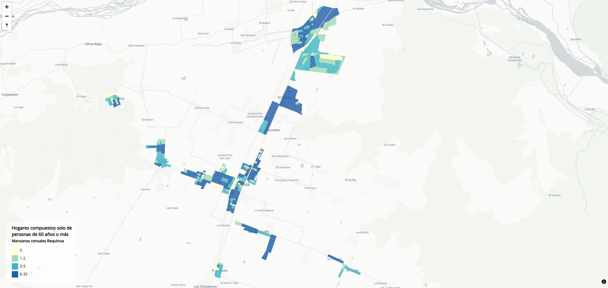

# Visualizador de variables censales por manzana — Censo 2024

Herramienta en **R** que genera un **mapa coroplético interactivo** de cualquier
variable disponible por manzana en la cartografía del Censo 2024. La variable a
mapear, la comuna y los cortes de la coropleta son **parámetros**: cambiando el
nombre de una columna del GeoPackage se obtiene un mapa nuevo, sin tocar el resto
del código. El caso de ejemplo es Requínoa, mapeando los hogares compuestos solo
por personas de 60 años o más.

## ¿Qué hace?

1. Carga la cartografía de manzanas del censo (GeoPackage) y filtra por comuna.
2. Calcula los cortes de la coropleta por **cuantiles** (o los toma de un vector
   definido a mano).
3. Genera un **mapa web interactivo** con MapLibre: relleno por clases, leyenda,
   popup por manzana y etiquetas con el valor.
4. Exporta el mapa como HTML autocontenido y una tabla Excel por manzana.

## Vista previa



## Stack

- R (`sf`, `tidyverse`, `openxlsx`, `RColorBrewer`)
- [`mapgl`](https://walker-data.com/mapgl/) (MapLibre GL JS desde R)
- `htmlwidgets` para exportar el mapa autocontenido

## Uso

Ajusta los parámetros al inicio de `visor_manzanas.R` y ejecuta:

```r
comuna_cut <- 6116          # código CUT de la comuna (6116 = Requínoa)
variable   <- "n_hog_60"    # columna del GPKG a mapear
etiqueta   <- "Hogares compuestos solo por personas de 60 años o más"
cortes     <- NULL          # NULL = cuantiles automáticos; o un vector, ej. c(1, 3, 6)
```

Para mapear otra variable basta con cambiar `variable` (y su `etiqueta`) por
cualquier columna numérica de la capa; si no existe, el script lista las
disponibles. Genera en `SALIDAS/` un `mapa_<comuna>_<variable>.html` y una tabla
Excel.

## Nota sobre los datos

La cartografía de manzanas del Censo 2024 es **pública** (INE) pero no se incluye
aquí por su peso. Déjala en `INPUT/`:

- `Cartografia_censo2024_R06.gpkg` (capa `Manzanas_CPV24`)

> Las variables mapeables son las que vengan **ya agregadas por manzana** en la
> cartografía. Los microdatos de personas del set público están geolocalizados
> solo hasta comuna, por lo que no permiten agregar variables arbitrarias a nivel
> de manzana.

Fuente: Censo 2024, INE — https://censo2024.ine.gob.cl/
